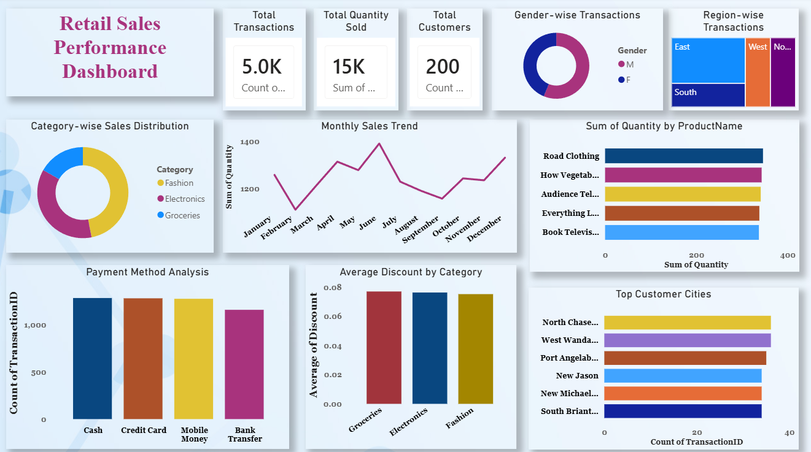

# Retail Sales Performance Dashboard | Power BI

## Project Overview

This project focuses on analyzing retail sales data and transforming raw transactional data into meaningful business insights through an interactive Power BI dashboard. The dashboard helps monitor sales performance, customer behavior, product trends, and regional performance to support data-driven decision-making.

## Business Problem

The client had a large volume of sales data but lacked clear visibility into:

* Sales performance across regions
* Customer purchasing behavior
* Product category performance
* Payment preferences
* Business growth opportunities

The objective was to convert raw data into actionable insights and recommendations.

## Dataset Information

* Transactions: 5,000 records
* Customers: 200 records
* Products: 50 records
* Stores: 5 locations

## Dashboard Features

* KPI Cards (Transactions, Quantity Sold, Customers, Average Discount)
* Monthly Sales Trend Analysis
* Payment Method Analysis
* Region-wise Transaction Analysis
* Category-wise Sales Distribution
* Gender-wise Customer Analysis
* Customer City Analysis
* Average Discount by Category

## Key Insights

* Analyzed over 5,000 retail transactions.
* Evaluated approximately 15,000 units sold.
* Average discount remained around 7.6%.
* Identified high-performing and underperforming regions.
* Analyzed customer purchasing patterns and payment preferences.
* Identified top-performing product categories and customer markets.

## Business Recommendations

* Focus on underperforming regions through targeted marketing campaigns.
* Promote high-demand products and optimize inventory planning.
* Use customer insights to design personalized marketing strategies.
* Implement dashboard-based KPI monitoring for better decision-making.
* Improve demand planning using historical sales trends.

## Tools & Technologies Used

* Microsoft Excel
* SQL (MySQL)
* Python
* Power BI
* Machine Learning (Linear Regression)

## Skills Demonstrated

* Data Cleaning and Preprocessing
* Data Analysis
* Business Analytics
* Data Visualization
* Dashboard Development
* KPI Analysis
* Business Problem Solving
* Decision Support Analytics

## Project Outcome

Developed an interactive business intelligence dashboard that transformed retail sales data into actionable insights and recommendations to support data-driven decision-making.

## Dashboard Preview

